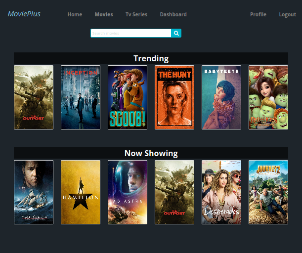
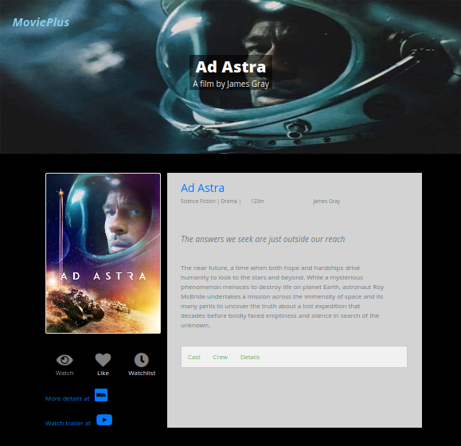
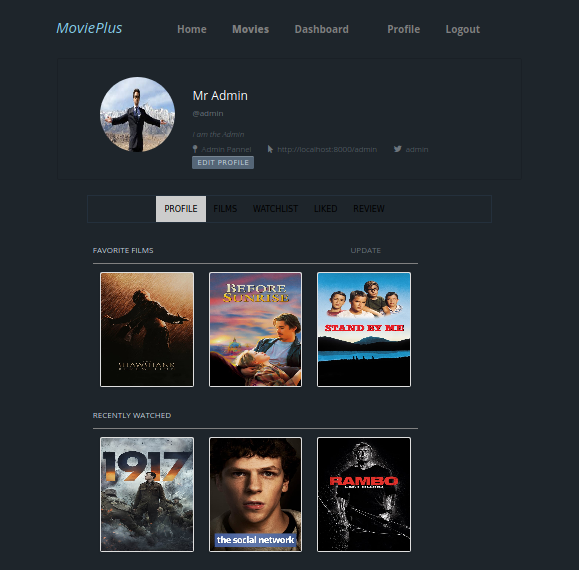

# MoviePlus-django
Movieplus is a django application that lets you create a profile and keep track of all your movies from one place.

A lite Django-React version of this application can be found [here](https://github.com/beingbiplov/MoviePlus)

Some features of this application are:
- Search any movies
- View movie details.(cast, overview, crew etc)
- Create your own profile.
- Add your favorite movies that shows on top of your profile page.
- Add movies to watchlist.
- Add movies to watched.
- Like a movie.
- and much more....

## Screenshots

   
   
  
   
   
  
   
   
  

  

